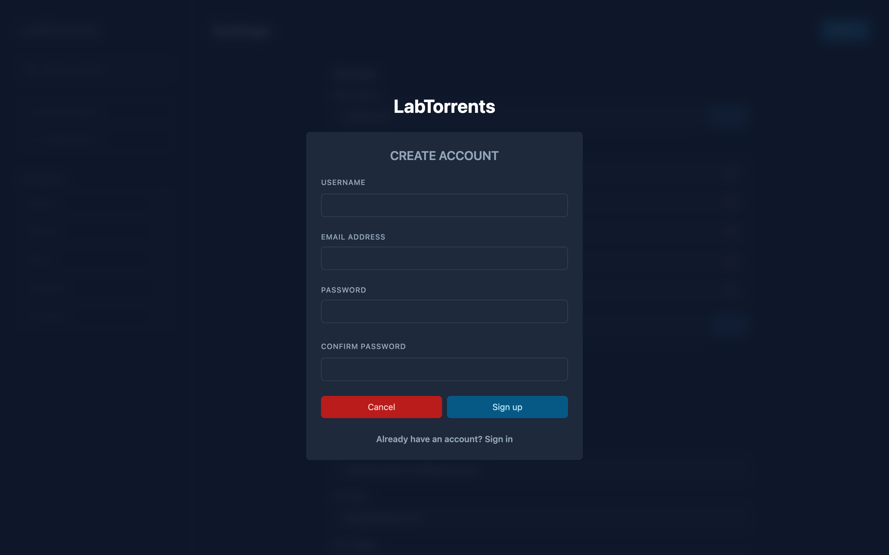
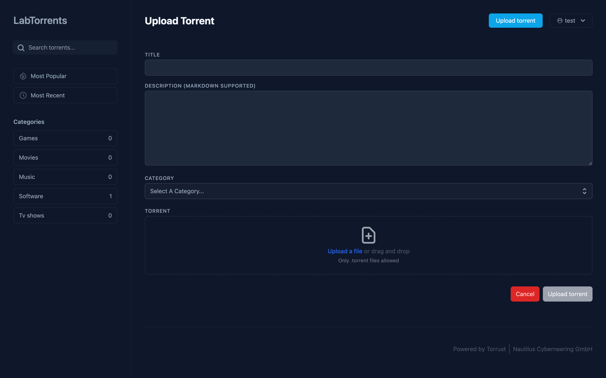
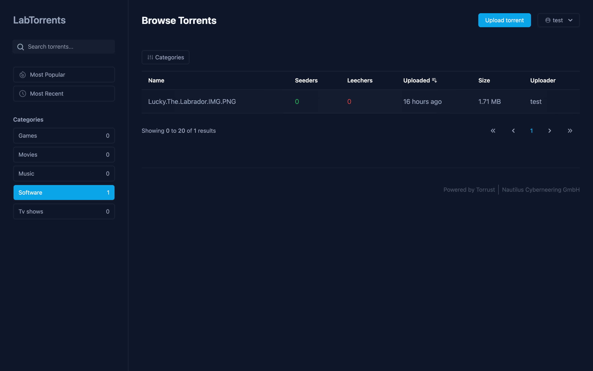
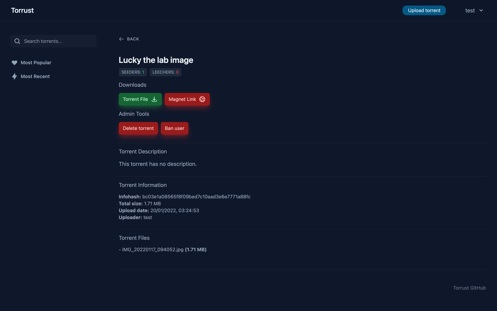

# torrust-index


## Project Description
torrust-index is a feature-rich torrent indexing website for the [torrust-tracker](https://github.com/torrust/torrust-tracker).

### Update 08-06-2022 (only for existing torrust-index users):
We have recently moved to a new project structure for the torrust-index project. The backend and frontend folders have been moved into their own repositories: [backend](https://github.com/torrust/torrust-index-backend) & [frontend](https://github.com/torrust/torrust-index-frontend). These repositories have now been included in this repository as submodules, and they have replaced the old backend and frontend sub folders. This however may lead to problems when updating from an older version of torrust (now torrust-index). __To update from an older version of torrust__:
1. Rename the old backend and frontend sub folders:
```bash
mv backend backend-old
mv frontend frontend-old
```

2. Pull the latest torrust-index and its submodules:
```bash
git pull
git pull --recurse-submodules
```

3. Copy your old config and database over:
```bash
cp backend-old/config.toml backend/config.toml
cp backend-old/data.db backend/data.db
cp frontend-old/.env frontend/.env
```
> You might also have to copy your old .env file over or do `cd backend` and `echo "DATABASE_URL=sqlite://data.db?mode=rwc" > .env
`

4. Rebuild the binaries and frontend:
```bash
cd backend
cargo build --release
cd ../frontend
npm i
npm run build
```
> NOTE: The backend binaries have been renamed to `torrust-index-backend`. To run them, do: `./target/release/torrust-index-backend`

### Features
* [X] User authentication
* [X] E-mail verification
* [X] Torrent sharing
* [X] Torrent searching & filtering
* [X] Private tracker compatible
* [X] Content & user moderation tools
* [X] Website customization

### Installation
Read the [installation documentation](https://torrust.github.io/torrust-documentation/installation/) for setting up the torrent index backend/frontend + [Torrust tracker](https://github.com/torrust/torrust-tracker).

### Screenshots






### Need

The reason behind this project was that Nautilus Cyberneering GmbH needed a solution that makes it easy for anyone with a computer and internet connection to share their files with the rest of the world.

### Approach

We will develop a BitTorrent tracker with a private and public tracker option and a web application for uploading and downloading torrents that are being tracked by the BitTorrent tracker.

### Benefit

Anyone will be able to host a (private) BitTorrent tracker and online torrent index with ease. And now they can share their digital content on their own torrent index :).

### Project Structure

- [__Backend__](https://github.com/torrust/torrust/tree/main/backend): A REST API written in Rust with the Actix web framework that acts as a backend for the web application.
- [__Frontend__](https://github.com/torrust/torrust/tree/main/frontend): A Vue application that acts as a frontend for the web application.
- [__Torrust Tracker__](https://github.com/torrust/torrust-tracker): A UDP and HTTP based torrent tracker built with Rust.
- [__Torrust Documentation__](https://github.com/torrust/torrust-documentation): A website made with MkDocs that hosts all the Torrust documentation.

### Project Roadmap

*Coming soon.*

### Credits
This project was developed by [Dutch Bits](https://dutchbits.nl) for [Nautilus Cyberneering GmbH](https://nautilus-cyberneering.de/).

### Contact
Message `Warm Beer#3352` on Discord or email `mick@dutchbits.nl`.
